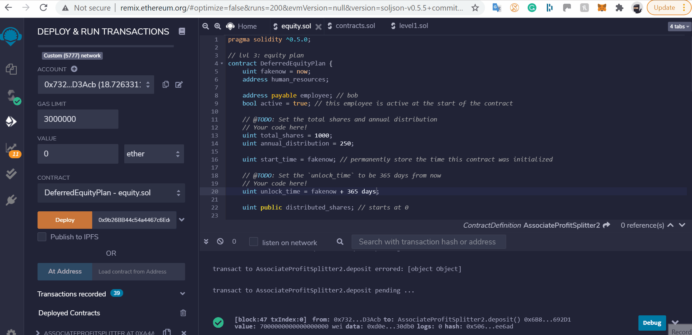

# Smart_Contracts

# SMART CONTRACT 1

This contract will accept Ether profits that the company makes and will be used by the company HR (Contract Sender) to divide it equally by the employees of the company. Any remainder Ether will return back to HR automatically. So technically the balance of this contract will always remain 0 at all times. 

 How this contract Operates : 
 
 - Payable 
 
 In order to transact between accounts payable must be provided after the 'address' instance
 
 - Constructor

This method assigns the input values for the variables we have initiated above. As you can see the employee addresses above constructor have no value. Therefore we are leaving it as an input feature for the user. 

- Deposit Function

Inorder to deposit Ether to the employee accounts we have to initate a value that takes the # msg.value. Msg.value basically is the amount being transacted or sent by the owner or sender of the contract which is HR as you can see in Line 6. 

- function () external payable 

This function has no name and is basically a fallback function. A fallback function is a function that we want to execute incase any the original function in the contract fails. In our case our fallback function does what the deposit function does. 

Open your ganache and copy and paste 3 child accounts one for each employee and paste them for each address. Make sure you MetaMask wallet is connected to your local host

# SMART CONTRACT 2 

This contract is very similar to the first contract. The only difference is that it splits the Ether based on employee hierarchy. The higher the greater. Any remainder Ether will be sent to the employee with the highest status (Employee One) 

- How this contract operates: 

The fundementls are all the same. Changes have been made in the deposit function to split the Ether proportionate to employee hiearchy and sending the remainder to the employee with the highest status

Deploying and using the contract are the same as the first one 

# SMART CONTRACT 3

The goal of this contract is to provide the employee with a number of shares evenly across his tenure. For example assume the company agrees to provide it's employee 1000 shares over the next 4 years. Each year the employee serves he would recieve 1000/4 = 250 shares. If say the employee leaves mid way he would only recieve 1000/2 = 500 shares and the remainder 500 would be sent back to HR. The employee and HR also both have the ability to deactivate this contract at will. 

- How this contract Operates: 

- Active

This is a boolean to indicate if the employee is active at the company or not

- Starttime / Fakenow / Unlock_time

Fakenow is a time functionality by solidity and we have set it to now , which is the time the contract is created and the employee signs with the company

Starttime is set to fakenow to indicate the start time of the contract 

Unlock_time is set to fakenow (now) + 365 days because the employee is eligble for 1 annual share distrubution per year. This variable will be used in a later function to tell the program that it is acceptable to transfer shares once a year has passed. 

- Distibuted shares

This is a balance of how many shares have been transfered to the employee so far and will start at 0 and will get updated as the years go on. 

- Distribute function

To to execute the share transfer a few secuirty parameters have to be met , which is why we use the "require" method insider this function. We are requiring that the transacting entities to have the correct account addresses linked to their identitiy. No one accounts others the ones provided can transact. We also require that the active parameter to be true , as the employee neeeds to be still working at the company. We also add an if statement to check if the total amount of shares is not larger than the one agreed upon

- Deactivate

Again we require only the two accounts of the HR and employee to be the only ones to deactivate this contract

This function switches active to false and this does not allow shares to be transfered.

to test this: 

uncomment the fastforward function in between deactivate  and external to fastforward in time aand see if you can deposit all the shares over time. After you finish testing it comment it out. 

Open you ganache and copy 1 child account to be as the employee account. Make sure you MetaMask is connected to you local host. 

# In this example i got an error when trying to send because 365 days did not pass. 

# Testnet contract addresses: 

1 : 0xA4A5Ea7fCFf4bAab088F52DDd0436e4c9bFdC144

2: 0x6B88d16D02D8A3c8f2Db79974bf8310b8E2692D1

3: 0xe5D7E72aEe441a7194b6dCA6497C80606B05A20E

